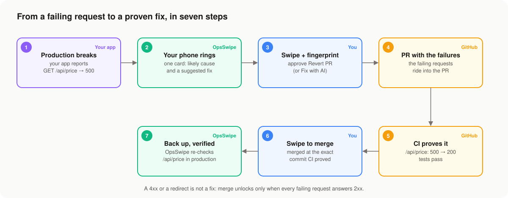
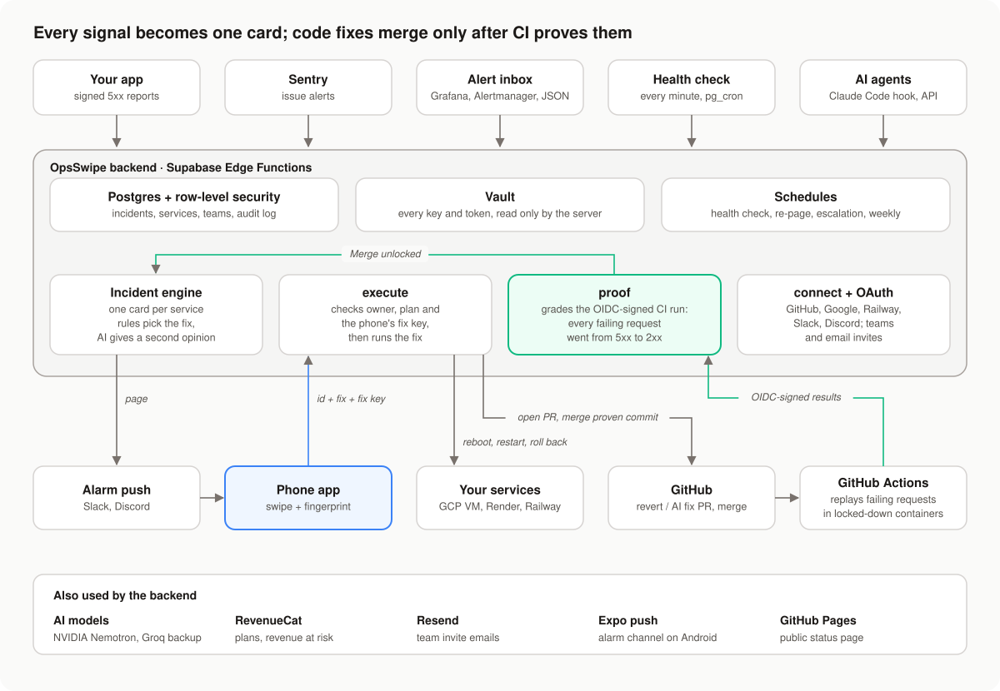

<div align="center">

# OpsSwipe

**The on-call pager that proves a fix before it touches production.**

When production breaks, OpsSwipe puts one card on your phone with the likely cause and a fix. Code fixes, including
ones written by AI, can merge only after CI replays the exact requests that failed in production. Nothing runs without
your swipe and fingerprint.

[](https://github.com/DevHusnainAi/opsswipe/actions/workflows/ci.yml)
[](LICENSE)


[](CONTRIBUTING.md)


**[▶ Watch the 2-minute demo](https://youtu.be/iTIDR-VaMnQ)**

[Features](#features) · [How it works](#how-it-works) · [Getting started](#getting-started) ·
[Security](#security) · [Contributing](#contributing) · [Demo video](#demo)

</div>

## For judges: try it in 3 minutes

OpsSwipe is a **Next Gen Award** entry for the RevenueCat Shipaton 2026, built solo by a student.

1. **Install** the Android app: [opsswipe-1.0.0.apk](https://github.com/DevHusnainAi/opsswipe/releases/latest/download/opsswipe-1.0.0.apk)
   (the same build as the video; allow installs from your browser when Android asks).
2. **Sign in** with GitHub, Google, or any email and password. No cloud account or setup is needed for the next step.
3. **Swipe the practice card.** Onboarding shows an outage card: swipe right and confirm with your fingerprint. It is
   the real swipe and the real fingerprint check, and nothing real is touched.
4. **See the paywall.** Onboarding then offers the 7-day trial through RevenueCat (Test Store: no real charge).

A real outage needs a service of your own to break, so the full loop (break, page, swipe, proof in CI, merge, back up)
is in the [2-minute video](https://youtu.be/iTIDR-VaMnQ), and every pull request and CI run it shows is public. The four
judging criteria, mapped to the video and the code: **[docs/SUBMISSION.md](docs/SUBMISSION.md)**.

## Table of contents

- [For judges](#for-judges-try-it-in-3-minutes)
- [About](#about)
- [Features](#features)
- [How it works](#how-it-works)
- [Getting started](#getting-started)
- [Configuration](#configuration)
- [Usage](#usage)
- [Plans and billing](#plans-and-billing)
- [Security](#security)
- [Testing and quality](#testing-and-quality)
- [Project structure](#project-structure)
- [Roadmap](#roadmap)
- [Contributing](#contributing)
- [License](#license)
- [Acknowledgements](#acknowledgements)

## About

Tests pass, the pull request merges, and production still breaks, because nobody tested the request real users sent.
AI tools now draft fixes, but those fixes are merged against the same tests that missed the bug.

OpsSwipe closes that gap: **the failing production traffic becomes the test.** It is built for indie developers and
small teams on Render, Railway, Google Cloud or any host that deploys from GitHub:

1. **A fix you can trust.** A revert, your own fix, or one written by AI with a regression test merges only after CI
   passes the requests that failed in production. OpsSwipe then checks production itself before it says "back up".
2. **Every AI agent asks your phone first.** Agents propose fixes or ask to run risky commands; you approve or decline
   with your fingerprint, and every answer is logged. A Claude Code hook is included.
3. **You see what the outage costs.** Connect your RevenueCat project and each incident shows revenue at risk.

## Features

**Detect**

- Signed 5xx reports from your app, Sentry alerts, alerts from any tool (Grafana, Alertmanager, JSON), and a
  health check every minute. One open incident per service.
- No false alarms: a failed check is retried, a single reported error is held until a second one confirms it, and an
  incident that recovers on its own closes itself.

**Page**

- Outages ring like an alarm: alarm volume, long vibration, lock screen. Unanswered pages repeat every 2 minutes, and
  your team is paged after 5 minutes.
- Optional Discord or Slack channel, a public status page, and a weekly report.

**Fix**

- Restart or roll back on Render and Railway, reboot a Google Cloud VM, open a revert PR, or let AI write the smallest
  fix plus a regression test.
- A suggested fix with a reason: deterministic rules decide; an AI model gives a second opinion that is shown, never
  obeyed.
- Swipe and fingerprint to run it. The server checks a key that the phone's secure hardware releases only after the
  fingerprint.

**Prove**

- Failing requests travel into the PR. CI replays them in locked-down containers and runs your tests; OpsSwipe grades
  the run itself (every request was 5xx and now answers 2xx).
- Merge is pinned to the exact commit that was proven.
- "Back up" arrives only when the failing requests work in production. A fix that didn't take brings the card back.

**Team and agents**

- Invite teammates by email: a link that joins them, after signing up if they are new. They can fix your incidents but never see your keys.
- An approval API for AI agents, with a ready-made Claude Code hook that fails closed.

**Learn**

- A postmortem after every real outage, the PR diff on your phone before you merge, and a public report link per
  resolved incident (what broke, what fixed it, how long) to share on X or LinkedIn.

## How it works





Everything that holds a key runs on the server (Supabase Edge Functions); the phone only approves. The reasoning
behind each design choice is in [docs/DECISIONS.md](docs/DECISIONS.md), and the code map in [CLAUDE.md](CLAUDE.md).

## Getting started

### Prerequisites

- [Node.js](https://nodejs.org/) 24 and npm
- [Deno](https://deno.com/) 2 (backend tests and tooling)
- A [Supabase](https://supabase.com/) project and the Supabase CLI (`npx supabase`)
- An [Expo](https://expo.dev/) account for EAS builds, and an Android phone
- A GitHub account to create the OpsSwipe GitHub App
- Optional: a Google Cloud project, a RevenueCat project, Slack/Discord/Railway OAuth apps, a Resend domain

### Quick start

```bash
git clone https://github.com/DevHusnainAi/opsswipe.git
cd opsswipe

# Backend: schema, functions, secrets
npx supabase link --project-ref <your-project-ref>
npx supabase db push
npx supabase secrets set CRON_SECRET=... GITHUB_APP_ID=... # see Configuration
npx supabase functions deploy

# App
cd app
npm ci
cp .env.example .env     # EXPO_PUBLIC_SUPABASE_URL, EXPO_PUBLIC_SUPABASE_KEY, EXPO_PUBLIC_RC_KEY
npx eas-cli build --platform android --profile development
npx expo start --dev-client
```

The full runbook (GitHub App, Google Cloud identity, push notifications, the demo service and an end-to-end
checklist) is in **[docs/SETUP.md](docs/SETUP.md)**.

### Try it

```bash
./infra/chaos.sh gcp                                         # the demo app stops: reboot the VM from the card
DEMO_REPO=../opsswipe-demo-target ./infra/chaos.sh release   # a bad release: revert or AI fix, prove, merge
./infra/chaos.sh heal                                        # back to a good release
```

Demo targets: [opsswipe-demo-target](https://github.com/DevHusnainAi/opsswipe-demo-target) (Google Cloud VM),
[opsswipe-demo-render](https://github.com/DevHusnainAi/opsswipe-demo-render),
[opsswipe-demo-railway](https://github.com/DevHusnainAi/opsswipe-demo-railway).

## Configuration

Server settings are Supabase Edge Function secrets (`npx supabase secrets set NAME=value`). Only the first group is
required; each optional group switches one feature on.

| Secret | Required | Purpose |
| --- | --- | --- |
| `CRON_SECRET` | yes | Authenticates the scheduled health check and weekly report |
| `GITHUB_APP_ID`, `GITHUB_APP_SLUG`, `GITHUB_APP_PRIVATE_KEY`, `GITHUB_APP_CLIENT_ID`, `GITHUB_APP_CLIENT_SECRET` | yes | Revert, fix and merge PRs; connecting GitHub |
| `REVENUECAT_SECRET_KEY`, `RC_WEBHOOK_AUTH` | yes | Server-side plan checks and the RevenueCat webhook |
| `GCP_SA_KEY`, `GOOGLE_CLIENT_ID`, `GOOGLE_CLIENT_SECRET` | for Google Cloud | Reboot VMs; Connect Google Cloud |
| `AI_SUGGESTIONS` (`nvidia` or `vertex`), `NVIDIA_API_KEY`, `NVIDIA_MODEL`, `AI_FALLBACK_*` | for AI | Second opinions, Fix with AI, postmortems |
| `SLACK_CLIENT_ID`, `SLACK_CLIENT_SECRET`, `DISCORD_CLIENT_ID`, `DISCORD_CLIENT_SECRET` | for chat | Add to Slack / Add to Discord |
| `RAILWAY_CLIENT_ID`, `RAILWAY_CLIENT_SECRET` | for Railway OAuth | Connect Railway (a pasted API token works without it) |
| `RESEND_API_KEY`, `MAIL_FROM` | for email invites | Invite teammates by email |
| `STATUS_PAGE_URL` | no | Where the static status page is hosted |

The app reads three public values from `app/.env`: `EXPO_PUBLIC_SUPABASE_URL`, `EXPO_PUBLIC_SUPABASE_KEY` (the
publishable key) and `EXPO_PUBLIC_RC_KEY` (the RevenueCat public SDK key).

## Usage

Connect everything from the app's **Services** screen:

| Connect | How | What OpsSwipe gets |
| --- | --- | --- |
| **Account** | Continue with GitHub or Google, or email and password | Your services, fixes and plan on any phone |
| **GitHub** | Install the OpsSwipe GitHub App on the repos you choose | 1-hour tokens to open and merge PRs there |
| **Google Cloud** | Sign in with Google, then pick a project and a VM | A custom role on each VM you add: read its status and reboot it |
| **Render** | Paste an API key (Render has no OAuth for outside apps) | Restart, roll back, read deploys, and set the service's report URL and secret |
| **Railway** | Connect Railway and choose projects on Railway's consent screen, or paste a token | Restart the live deployment, roll back, and set the service's report URL and secret |
| **Failure reports** | Set for you on Render, Railway and Google Cloud VMs; elsewhere, two environment variables and a small snippet (below) | Your app's 5xx responses the moment they happen |
| **Sentry** | An Internal Integration with the webhook URL the app shows | Sentry issue alerts open incidents |
| **Slack or Discord** | Settings → Add to Slack / Add to Discord | Alerts in the channel you pick |
| **Proof in CI** | Services → Add proof to repo, then merge the PR | A workflow that replays saved production failures on every PR |

### Failure reports

Any stack works: POST a JSON body to `OPSSWIPE_REPORT_URL`, signed with HMAC-SHA256 of the exact body under
`REPORT_SECRET`, in the header `x-opsswipe-signature: sha256=<hex>`. Only 5xx responses count. `release` (the deployed
commit) is optional and tells a revert which commit broke production. Add `"test": true` to check your setup without
opening an incident. Express:

```js
// Express, Node 18+: report every 5xx to OpsSwipe (method, path, status only)
const { createHmac } = require('node:crypto');
app.use((req, res, next) => {
  res.on('finish', () => {
    const { OPSSWIPE_REPORT_URL: url, REPORT_SECRET: key, GIT_SHA } = process.env;
    if (res.statusCode < 500 || !url || !key) return;
    const body = JSON.stringify({ method: req.method, path: req.originalUrl, status: res.statusCode, release: GIT_SHA });
    const sig = 'sha256=' + createHmac('sha256', key).update(body).digest('hex');
    fetch(url, { method: 'POST', headers: { 'content-type': 'application/json', 'x-opsswipe-signature': sig }, body }).catch(() => {});
  });
  next();
});
```

## Plans and billing

Billing runs on [RevenueCat](https://www.revenuecat.com/). Entitlements are checked on the server, with a copy kept by
webhook so a billing outage never blocks a fix.

| Plan | What you get |
| --- | --- |
| **Free** | Your first outage start to finish (the revert, the proof and the merge); status page; weekly report |
| **Pro** ($14.99/month or $119.99/year) | Every outage and unlimited services, AI fixes with regression tests, fix ready before you wake up, alert inbox, agent approvals |
| **Team** ($39.99/month or $359.99/year, up to 10 people) | Everything in Pro, teammates who can fix your incidents, 5-minute escalation |

Every paid plan starts with a 7-day free trial, offered once during onboarding and never in the middle of an outage.
Billing is per outage, not per action, so no paywall sits between a revert PR and its proven merge.

## Security

OpsSwipe can restart services, reboot machines and merge code, so it is built to be safe by default:

| Threat | Mitigation |
| --- | --- |
| A stolen or unlocked phone | Every fix needs the fingerprint, and the server checks a key the phone's secure hardware releases only after it. A copied session can't run a fix |
| The client choosing what runs | The phone sends only an incident id and a fix name; the server decides from validated config |
| Another user's data | Row-level security on every table; a SQL test grants clients full rights and checks every write is still refused |
| Cloud keys | Kept in Supabase Vault and read only by server code. Google Cloud access is a custom reset-only role, re-checked against your own account before every reset and removed when you disconnect |
| A connect link sent to someone else | Connections finish only on the phone that approved them, for the account that started them (Railway, whose consent page never returns to the app, finishes for the account that started it) |
| Crafted sign-in links | Sign-in uses PKCE; tokens in a link are never accepted |
| Forged or gamed CI proofs | OIDC-signed, bound to the commit OpsSwipe opened, PR code in locked-down containers, graded by OpsSwipe (a 4xx is not a fix) |
| Probing internal networks | Service URLs must be public, re-checked after DNS before every probe |
| Prompt injection | Request data reaches the AI as escaped, tagged data; its output is checked by code |
| Rogue AI agents | Agents only propose; the Claude Code hook is default-deny and fails closed |

Report a vulnerability privately: see **[SECURITY.md](SECURITY.md)**. Design decisions, including an independent audit
and its fixes, are in [docs/DECISIONS.md](docs/DECISIONS.md).

## Testing and quality

```bash
deno task test && deno task check && deno task lint && deno fmt --check   # backend
deno task eval                                                            # fix suggestions: must be 100% safe
cd app && npm run typecheck && npm run lint && npm test                   # app
```

- **112 backend tests** (Deno): providers, OAuth completion, proof grading, recovery checks, paging, the incident state
  machine, signing, scrubbing, network guard and more.
- **SQL tests** on Postgres 17: row-level security, the free-outage meter, and client writes refused under full grants.
- **Eval**: 15 labeled incidents score fix suggestions on safety (must be 100%), correctness and concision; any model
  can be scored with `deno task eval nvidia`.
- **Shell tests** for the Claude Code hook; app tests for formatting and reports.
- **CI** on every push: format, lint, typecheck, tests, eval, shellcheck and SQL tests. **CD** deploys migrations and
  functions when `main` is green.

## Project structure

```text
app/                   Expo / React Native client (Android)
supabase/functions/    Edge Functions, one per endpoint; shared logic in _shared/, tests in tests/
supabase/migrations/   Postgres schema: RLS, Vault, meters, schedules
supabase/tests/        SQL tests
evals/suggest/         Labeled incidents that score fix suggestions
infra/                 Demo service, Google Cloud setup, chaos script
integrations/          Claude Code approval hook
status-page/           Static public status page
docs/                  Setup runbook, design decisions, brand assets
```

## Roadmap

The failing traffic as the test is the idea everything next grows from:

- **Prove every fix, not just code fixes**: before a rollback, CI builds the older commit and replays the failing
  requests against it (never against production).
- **An outage memory per repo**: every PR shows which past outages it was checked against, and warns when a change
  would bring one back.
- **A human in the loop for every AI agent**: an MCP server on top of the Approval API, so any agent needs a swipe and
  a fingerprint before a risky action.
- **On-call for small teams**: rotations, phone-call and SMS escalation, two-person approval for risky fixes.
- **Revenue decides what comes first**: one-tap RevenueCat connection (OAuth instead of a key); when two things break,
  the costlier one pages first.
- **Everywhere indie apps run**: Google Play and iOS releases; Fly.io, Vercel and Kubernetes; scale-up as a fix.
- **Hardening**: probes connect to the checked IP (closes DNS rebinding), a list of signed-in phones to revoke fix
  keys, and Google OAuth verification so Connect Google Cloud shows no warning screen.

## Contributing

Contributions are welcome. Read [CONTRIBUTING.md](CONTRIBUTING.md) for setup and the checks CI runs, and follow the
[Code of Conduct](CODE_OF_CONDUCT.md). Changes are listed in [CHANGELOG.md](CHANGELOG.md).

## License

[MIT](LICENSE) © 2026 Syed Husnain Khalid. See also the [privacy policy](PRIVACY.md) and [terms of use](TERMS.md).

## Acknowledgements

Built for the [RevenueCat Shipaton 2026](https://www.revenuecat.com/shipaton/) (Next Gen Award) with
[Claude Code](https://claude.com/claude-code). Judges: what the video shows and where to look in the code are in
[docs/SUBMISSION.md](docs/SUBMISSION.md).

### Demo

[](https://youtu.be/iTIDR-VaMnQ)

Everything in the video is real: a real Android phone, a Google Cloud VM, Render and Railway services, real pull
requests and real CI runs (for example [the revert PR with its passing proof](https://github.com/DevHusnainAi/opsswipe-demo-target/pull/6)).
