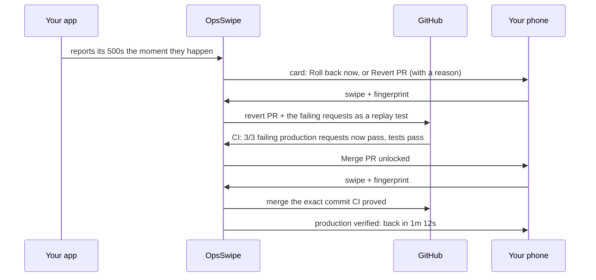

# OpsSwipe

**Your app's backend breaks while you're at dinner. Fix it from your phone, and OpsSwipe proves it worked.**

OpsSwipe is a pager for indie developers and small teams. When production fails, you get an incident card with one suggested
fix. Swipe, confirm with your fingerprint, and it runs. It is the first phone pager that won't let a code fix merge (yours,
a revert, or one Claude wrote) until CI passes **the exact requests that failed in production**, and then it confirms
production actually recovered.

Built for the RevenueCat Shipaton 2026 (Next Gen Award), with Claude Code.

> Demo video: _link_

> **For the judges**
> - **Idea:** solo developers have no on-call partner. OpsSwipe confirms an outage before paging, suggests one fix, runs it
>   after a swipe and a fingerprint, and proves code fixes against the real failing traffic before they can merge.
> - **Working core:** real fixes on a real cloud: a Google Cloud VM reboot, a revert or AI fix PR replayed in GitHub
>   Actions, and a merge pinned to the proven commit. [The loop](#the-verified-fix-loop).
> - **RevenueCat, thoughtfully:** your first *outage* is free, start to finish; the paywall appears at the moment of need
>   and names the service that's down; Pro is checked on the server, with a webhook-kept copy so a billing outage never
>   blocks a fix. [Monetization](#monetization-revenuecat).
> - **Technical care:** least-privilege cloud access, OIDC-signed proofs, row-level security, 59 backend tests, a
>   100%-safety eval, SQL tests on Postgres 17, CI on every push. [Security model](#security-model), [Quality](#quality).

## Why

Tests pass, the PR merges, and production still breaks, because nobody tested the request that real users sent. AI tools can
now draft fixes (Sentry Seer opens fix PRs), but you still merge them against the same tests that missed the bug. OpsSwipe
closes that gap: **the failing production traffic becomes the test.**

## The verified-fix loop



## What it does

| Feature | How |
| --- | --- |
| **Instant detection** | Your app signs and reports every 5xx, or your Sentry alerts do; a 60 s liveness check covers services too dead to report |
| **No false alarms** | A failed check is retried after 10 s before anyone is paged; a service that recovers on its own closes its card; a false alarm is dismissed in one tap and logged |
| **Paged on your lock screen** | A high-priority push when something breaks, when CI proves the fix and when it's back up, even with the app closed; optionally mirrored to Discord or Slack |
| **Fixes across clouds** | Restart or roll back a Render or Railway service; reboot a Google Cloud VM; open a revert PR; merge a proven PR |
| **Fix with AI** | Claude writes the smallest code fix, touching only the files the bad commit changed; it ships as a PR that must pass the same replay proof before Merge unlocks |
| **Repo linking** | Any service (Render or a GCP VM) can be linked to the repo it deploys from; the app can report its running commit (`release`) so OpsSwipe knows exactly what broke |
| **Approval API for AI agents** | An AI SRE or script proposes a fix with a token from Settings; it appears as a card with the agent's name, runs only after your swipe and fingerprint, and the agent can poll the result |
| **Suggested fix with a reason** | Rules answer instantly (recent deploy: roll back); Claude Opus 5 on Vertex AI refines it, and can only pick allowed fixes |
| **Proof before merge** | Failing requests ride into the PR as `.opsswipe/replays/*.json`; CI replays them and runs your tests; merge unlocks only on a full pass, pinned to that commit |
| **Proof after deploy** | The first healthy check after a fix records it: "down 3m 12s, back 41s after fix" |
| **A failed proof isn't a dead end** | If CI says 2/3, the card offers Fix with AI again with those failures (and a revert, unless the revert is what failed) |
| **Tell your users** | One tap shares a plain-text incident report (detected, fix approved, back up, proof) to X, Discord or a status page; Activity shows the week's incidents, median recovery and proven fixes |
| **Swipe + fingerprint** | A deliberate swipe picks the fix; biometrics authorize it; a tap button and TalkBack actions do the same without dragging |
| **Audit log** | Every attempt is recorded: executed, paywalled, failed, with PR links |

## Connect in two minutes

From the app's **Services** screen:

| Connect | How | What OpsSwipe gets |
| --- | --- | --- |
| **Account** | Continue with GitHub, or email and password | Your services, fixes and plan on any phone |
| **GitHub** | Install the OpsSwipe GitHub App on your account (all repos, or only the ones you pick) | 1-hour tokens to open and merge PRs on those repos |
| **Render** | Paste an API key once | Restart, roll back and read deploys; the key is encrypted and never shown again |
| **Railway** | Paste an API token once, then each service's dashboard link | Restart the live deployment or roll back to the previous one |
| **Google Cloud** | Sign in with Google once, then pick a project and a VM any time | A custom role on each VM you add: read its status and reboot it (Google's `reset`: a power-cycle, disk data stays). Google access is kept encrypted so adding VMs needs no new sign-in; Disconnect revokes it |
| **Failure reports** (optional) | Set the two env vars the app shows once and add the snippet below | Your app's 5xx responses, signed, the moment they happen. Without it, the every-minute health check still pages you |
| **Sentry** (optional) | A Sentry Internal Integration with the webhook URL the app shows, then paste its Client Secret | Sentry issue alerts open incidents with the failing request, with no code change in your app |
| **Discord or Slack** (optional) | Paste an incoming webhook URL in Settings | Every alert also posts to that channel |
| **Proof in CI** | Setup checklist → Turn on proof, and merge the PR | A workflow that replays saved production failures on every PR, authenticated by GitHub OIDC |

Merging a proven PR fixes production when your host deploys `main` automatically (Render, Railway, most platforms; the demo
VM pulls `main` every 30 s). On a plain VM without deploys, merge, then deploy as you usually do.

### Failure reports

Any stack works: POST a small JSON body to `OPSSWIPE_REPORT_URL`, signed with HMAC-SHA256 of the exact body under
`REPORT_SECRET`, in the header `x-opsswipe-signature: sha256=<hex>`. Only 5xx responses count. `release` (the deployed
commit, 40 hex characters) is optional and tells a revert or AI fix which commit broke production. Express:

```js
// Express, Node 18+: report every 5xx to OpsSwipe (method, path, status only)
const { createHmac } = require('node:crypto');
app.use((req, res, next) => {
  res.on('finish', () => {
    const { OPSSWIPE_REPORT_URL: url, REPORT_SECRET: key, GIT_SHA } = process.env;
    if (res.statusCode < 500 || !url || !key) return;
    const body = JSON.stringify({ method: req.method, path: req.originalUrl, status: res.statusCode, release: GIT_SHA });
    const sig = 'sha256=' + createHmac('sha256', key).update(body).digest('hex');
    fetch(url, { method: 'POST', headers: { 'content-type': 'application/json', 'x-opsswipe-signature': sig }, body }).catch(() => {});
  });
  next();
});
```

## Monetization (RevenueCat)

| Plan | What you get |
| --- | --- |
| Free | Your first outage, start to finish: the revert, the proof and the merge are all included |
| Pro ($4.99/month, $39.99/year) | Every outage after |

- **Priced per outage, not per action.** Metering each swipe would put a paywall between a revert PR and its proven merge,
  in the middle of an outage. The free tier covers one whole incident instead, counted by an atomic Postgres function and
  refunded if its first fix fails.
- The paywall appears at the moment of highest intent and says what's at stake ("api is down… Pro fixes it now"). It's a
  RevenueCat Paywall, so pricing and copy change from the dashboard; Restore and Customer Center are in Settings.
- **Nothing can be unlocked on the phone.** Every fix checks the `pro` entitlement with RevenueCat's REST API on the server.
- **A billing outage never blocks a fix.** RevenueCat webhooks keep a copy of each plan's expiry in Postgres; if the REST API
  is unreachable, the server falls back to it.
- Flat price for one person, no per-seat or per-SMS fees.

## Security model

| Threat | Mitigation |
| --- | --- |
| Stolen or unlocked phone | Every fix requires biometrics, and the prompt names the consequence |
| Leaked keys | The app holds only public keys. Users' Render keys and report secrets are encrypted in Supabase Vault; GitHub access uses 1-hour app tokens |
| Client picks what to run | The phone sends an incident id and an offered fix; the server checks the service's validated config and the incident |
| Another user's services | Row-level security on every table; a fix can only be claimed by the incident's owner |
| Handing over cloud keys | Nobody does. Fixes run as OpsSwipe's own identity, which can only `reset` and `get` the VMs you added. Your Google refresh token (used only to list projects and grant that role) is encrypted in Vault and revoked at Google on Disconnect |
| Spoofed GitHub installation | Each installation is verified with the installing user's own OAuth token before it's stored |
| Forged failure reports | Each service signs reports with its own secret (HMAC-SHA256, constant-time check); Sentry webhooks are verified with the integration's Client Secret; RevenueCat webhooks with a shared Authorization value |
| Alert channel as a way into your network | Only `https://discord.com/api/webhooks/…` and `https://hooks.slack.com/services/…` are accepted, and a test message must succeed before the URL is kept |
| Account deletion | Settings → Delete account revokes Google, deletes every secret, service, incident and log row |
| Forged CI proofs | Proofs carry a GitHub Actions OIDC token, verified against GitHub's keys; no secrets live in your repo |
| Merging something other than what was proven | Proof is bound to the PR's head commit, and the merge is pinned to that `sha` (GitHub returns 409 otherwise) |
| Replay causing side effects | Requests are replayed only against the PR build in CI, never production; samples carry no headers or cookies |
| Double swipe | The incident is claimed atomically; the second request gets 409 |
| Tampered state | Row-level security: clients only read their own audit and usage rows; every write goes through the server |

More in [docs/DECISIONS.md](docs/DECISIONS.md).

## Quality

- **Tests:** 59 Deno tests (providers incl. Railway, Connect keys and OIDC, Google grant, push, alert-webhook allowlist,
  Sentry and RevenueCat webhooks, confirm-before-paging, rollback, revert and merge PRs, signing, sample scrubbing, proof
  binding, the incident flow incl. failed proofs, suggestions), SQL tests for the free-outage meter and tenant isolation
  (row-level security, Vault access) on Postgres 17, 2 tests for the demo service's reporting, and app tests for the
  recovery timeline, incident report and weekly stats.
- **Eval:** 14 labeled incident scenarios score fix suggestions on allowlist safety (must be 100%), correctness and concision.
  `deno task eval` runs the rules in CI; `deno task eval vertex` scores Claude.
- **CI:** format, lint, typecheck, tests, eval, migrations and app checks on every push.

## Stack

Expo SDK 57, React Native, Reanimated 4, Gesture Handler, expo-haptics, expo-local-authentication, expo-notifications, Geist
fonts, Phosphor icons · RevenueCat (`react-native-purchases`, `react-native-purchases-ui`) · Supabase (Postgres, Realtime, Edge
Functions, Cron, Vault) · Claude Opus 5 on Vertex AI · GitHub Git Data API and Actions · Render · Railway · GCP Compute
Engine · Sentry, Discord and Slack webhooks

## Run it

Everything, step by step: [docs/SETUP.md](docs/SETUP.md). Then break something:

```bash
./infra/chaos.sh gcp                                         # the demo app stops: reboot the VM from the card
DEMO_REPO=../opsswipe-demo-target ./infra/chaos.sh release   # a bad release: revert or AI fix, prove, merge
```

## Roadmap

- Reports from Datadog and Alertmanager
- More fixes: scale up, restart a Kubernetes deployment, roll back on Fly, Vercel and Coolify
- Escalation: call or SMS when a push goes unanswered; a hosted status page
- Team plan, two-person approval for risky fixes
- Google OAuth verification, so Connect Google Cloud has no warning screen or 100-user cap

## License

MIT
