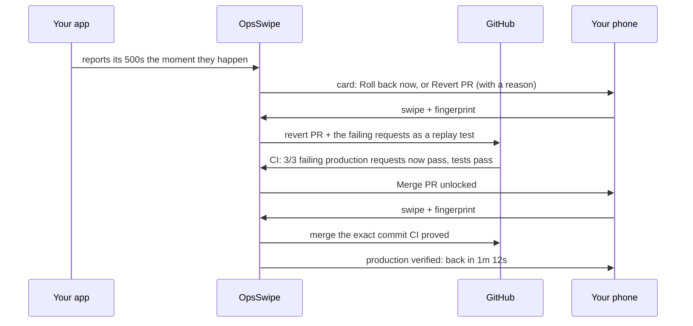

# OpsSwipe

**Your app's backend breaks while you're at dinner. Fix it from your phone, and OpsSwipe proves it worked.**

OpsSwipe is a pager for indie developers and small teams. When production fails, you get an incident card with one suggested
fix. Swipe, confirm with your fingerprint, and it runs. And unlike other tools, OpsSwipe won't let you merge a code fix until it
passes **the exact requests that failed in production**, then confirms production actually recovered.

Built for the RevenueCat Shipaton 2026 (Next Gen Award), with Claude Code.

> Demo video: _link_

## Why

Tests pass, the PR merges, and production still breaks, because nobody tested the request that real users sent. AI tools can
now draft fixes (Sentry Seer opens fix PRs), but you still merge them against the same tests that missed the bug. OpsSwipe
closes that gap: **the failing production traffic becomes the test.**

## The verified-fix loop



## What it does

| Feature | How |
| --- | --- |
| **Instant detection** | Your app signs and reports every 5xx; a 60 s liveness check covers services too dead to report |
| **Paged on your lock screen** | A high-priority push when something breaks and again when CI proves the fix, even with the app closed |
| **Fixes across clouds** | Restart or roll back a Render service; reset a GCP VM; open a revert PR; merge a proven PR |
| **Suggested fix with a reason** | Rules answer instantly (recent deploy: roll back); Claude Opus 5 on Vertex AI refines it, and can only pick allowed fixes |
| **Proof before merge** | Failing requests ride into the PR as `.opsswipe/replays/*.json`; CI replays them and runs your tests; merge unlocks only on a full pass, pinned to that commit |
| **Proof after deploy** | The first healthy check after a fix records it: "down 3m 12s, back 41s after fix" |
| **Swipe + fingerprint** | A deliberate swipe picks the fix; biometrics authorize it; a tap button and TalkBack actions do the same without dragging |
| **Audit log** | Every attempt is recorded: executed, paywalled, failed, with PR links |

## Connect in two minutes

From the app's **Services** screen:

| Connect | How | What OpsSwipe gets |
| --- | --- | --- |
| **Account** | Sign in with GitHub | Your setup and plan on any phone (you start as a guest) |
| **GitHub** | Install the OpsSwipe GitHub App on the repos you pick | 1-hour tokens to open and merge PRs on those repos |
| **Render** | Paste an API key once | Restart, roll back and read deploys; the key is encrypted and never shown again |
| **Google Cloud** | Sign in with Google, pick a VM | A custom role on that one VM: read its status and reset it. Your Google token is deleted right after |
| **Failure reports** | Set the two env vars the app shows once | Your app's 5xx responses, signed, the moment they happen |
| **Proof in CI** | Tap "Add proof to repo" and merge the PR | A workflow that replays saved production failures on every PR, authenticated by GitHub OIDC |

## Monetization (RevenueCat)

| Plan | What you get |
| --- | --- |
| Free | Your first fix, so you see it work on a real outage |
| Pro ($4.99/month, $39.99/year) | Unlimited fixes |

- The paywall appears at the moment of highest intent: production is down and your free fix is used. It's a RevenueCat Paywall,
  so pricing and copy change from the dashboard.
- **Nothing can be unlocked on the phone.** Every fix checks the `pro` entitlement with RevenueCat's REST API on the server, and
  the free fix is counted by an atomic Postgres function, refunded if the fix fails.

## Security model

| Threat | Mitigation |
| --- | --- |
| Stolen or unlocked phone | Every fix requires biometrics, and the prompt names the consequence |
| Leaked keys | The app holds only public keys. Users' Render keys and report secrets are encrypted in Supabase Vault; GitHub access uses 1-hour app tokens |
| Client picks what to run | The phone sends an incident id and an offered fix; the server checks the service's validated config and the incident |
| Another user's services | Row-level security on every table; a fix can only be claimed by the incident's owner |
| Handing over cloud keys | Nobody does: Google sign-in is used once to grant OpsSwipe's identity a role that can only `reset` and `get` one VM, then deleted |
| Spoofed GitHub installation | Each installation is verified with the installing user's own OAuth token before it's stored |
| Forged failure reports | Each service signs reports with its own secret (HMAC-SHA256, constant-time check) |
| Forged CI proofs | Proofs carry a GitHub Actions OIDC token, verified against GitHub's keys; no secrets live in your repo |
| Merging something other than what was proven | Proof is bound to the PR's head commit, and the merge is pinned to that `sha` (GitHub returns 409 otherwise) |
| Replay causing side effects | Requests are replayed only against the PR build in CI, never production; samples carry no headers or cookies |
| Double swipe | The incident is claimed atomically; the second request gets 409 |
| Tampered state | Row-level security: clients only read their own audit and usage rows; every write goes through the server |

More in [docs/DECISIONS.md](docs/DECISIONS.md).

## Quality

- **Tests:** 34 Deno tests (providers, Connect keys and OIDC, Google grant, push, rollback, revert and merge PRs, signing, sample scrubbing, proof binding, incident flow, suggestions),
  SQL tests for the free-fix meter and tenant isolation (row-level security, Vault access) on Postgres 17, 2 tests for the demo service's reporting, and
  app tests for the recovery timeline.
- **Eval:** 12 labeled incident scenarios score fix suggestions on allowlist safety (must be 100%), correctness and concision.
  `deno task eval` runs the rules in CI; `deno task eval vertex` scores Claude.
- **CI:** format, lint, typecheck, tests, eval, migrations and app checks on every push.

## Stack

Expo SDK 57, React Native, Reanimated 4, Gesture Handler, expo-haptics, expo-local-authentication, expo-notifications, Geist
fonts, Phosphor icons · RevenueCat (`react-native-purchases`, `react-native-purchases-ui`) · Supabase (Postgres, Realtime, Edge
Functions, Cron, Vault) · Claude Opus 5 on Vertex AI · GitHub Git Data API and Actions · Render · GCP Compute Engine

## Run it

Everything, step by step: [docs/SETUP.md](docs/SETUP.md). Then break something:

```bash
DEMO_REPO=../opsswipe-demo-target ./infra/chaos.sh release   # a bad release: roll back, revert, prove, merge
```

## Roadmap

- Reports from Sentry, Datadog and Alertmanager, not just our SDK-free reporter
- AI-written patch PRs that go through the same proof
- More fixes: scale up, restart a Kubernetes deployment, roll back on Fly and Vercel
- An approval API so any AI SRE agent can ask a human to approve a proven fix
- Team plan, two-person approval for risky fixes
- Google OAuth verification, so Connect Google Cloud has no warning screen or 100-user cap

## License

MIT
