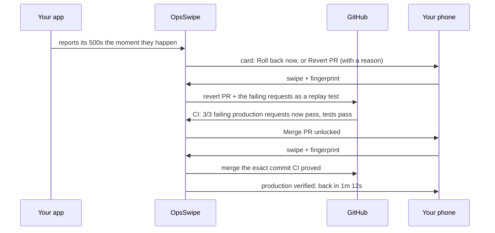
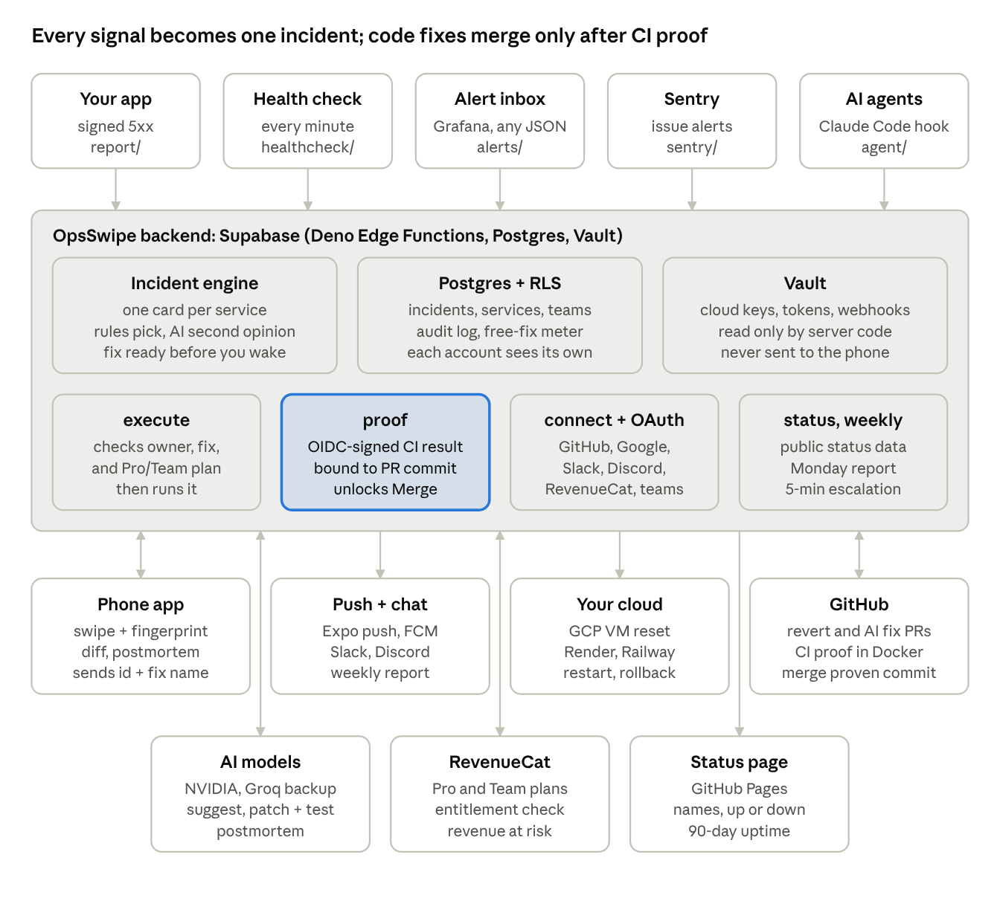

# OpsSwipe

[](https://github.com/DevHusnainAi/opsswipe/actions/workflows/ci.yml)

**AI writes your code now. OpsSwipe makes sure its fixes are proven before they touch production, and shows what every
minute of downtime costs, from your lock screen.**

OpsSwipe is a pager for indie developers and small teams, built on three ideas:

1. **Who checks the fix AI writes at 3am?** When production breaks, OpsSwipe suggests one fix. Code fixes (yours, a
   revert, or one the AI wrote with a regression test) can't merge until CI passes **the exact requests that failed in production**, and
   nothing runs without your swipe and fingerprint. OpsSwipe then confirms production actually recovered.
2. **Every AI agent that touches production asks your phone first.** Agents propose fixes or ask to run a risky
   command; you approve or decline with your fingerprint, and every answer is logged. A Claude Code hook is included.
3. **You see what the outage costs.** Connect your RevenueCat and every incident shows *~$4.20/h at risk*; the recovery
   shows *about $0.08 lost*.

As far as we could find, it's the first phone pager that proves a fix against real failing traffic before it can merge.

Built for the RevenueCat Shipaton 2026 (Next Gen Award), with Claude Code.

> Demo video: _link_

> **For the judges** (Next Gen)
> - **Idea:** a student's app makes money while they sleep, until the backend breaks. OpsSwipe turns the outage into one
>   card with a fix attached, has the AI fix *and a regression test* ready before you wake, and lets it merge only after
>   CI replays **the exact requests that failed in production**. It also makes AI agents ask your phone before they touch
>   production. We read all 1,964 Shipaton write-ups: none describes proving a fix against real failing traffic.
> - **Progress:** a working loop on real infrastructure: a Google Cloud VM reboot, a revert or AI fix PR proven in GitHub
>   Actions and merged pinned to the proven commit, push and Discord alerts, status page, teams with escalation, alert
>   inbox, onboarding with a fingerprint practice run. [The loop](#the-verified-fix-loop), [architecture](#architecture).
> - **RevenueCat, thoughtfully:** part of the product, not just the paywall. Your own RevenueCat revenue turns every
>   incident into *$ per hour at risk*; the first outage is free start to finish; Free / Pro / Team with monthly and
>   yearly plans and a 7-day trial offered once, never mid-outage; entitlements checked on the server, with a
>   webhook-kept copy so a billing outage never blocks a fix. [Monetization](#monetization-revenuecat).
> - **Care:** least-privilege cloud access, row-level security, OIDC-signed proofs with the PR's code isolated in
>   Docker, prompts that treat request data as data, 86 backend tests, SQL tenancy tests on Postgres 17, a 100%-safety
>   eval, CI and CD on every push, privacy policy and terms. Built openly with Claude Code.
>   [Security model](#security-model), [Quality](#quality).

## Why

Tests pass, the PR merges, and production still breaks, because nobody tested the request that real users sent. AI tools can
now draft fixes (Sentry Seer opens fix PRs), but you still merge them against the same tests that missed the bug. OpsSwipe
closes that gap: **the failing production traffic becomes the test.**

## The verified-fix loop



## Architecture



Five sources (your app's signed 5xx reports, a health check every minute, the alert inbox, Sentry, AI agents) open one
incident per service. Everything with a key runs on the server; the phone only approves. Details in [CLAUDE.md](CLAUDE.md).

## What it does

| Feature | How |
| --- | --- |
| **Instant detection** | Your app signs and reports every 5xx, or your Sentry alerts do; a 60 s liveness check covers services too dead to report |
| **No false alarms** | A failed check is retried after 10 s before anyone is paged; a service that recovers on its own closes its card; a false alarm is dismissed in one tap and logged |
| **Paged on your lock screen** | A high-priority push when something breaks, when CI proves the fix and when it's back up, even with the app closed; optionally mirrored to Discord or Slack |
| **Fixes across clouds** | Restart or roll back a Render or Railway service; reboot a Google Cloud VM; open a revert PR; merge a proven PR |
| **Fix with AI** | The AI model writes the smallest code fix, touching only the files the bad commit changed, plus one regression test for the failing requests; it ships as a PR that must pass your tests and the same replay proof before Merge unlocks. Read the diff in the app before you swipe |
| **Fix ready before you wake up** (Pro) | Opt in per service: the moment it breaks, the AI fix is written, opened as a PR and proven by CI. The push says *"a fix is ready and proven"*; you only swipe to merge |
| **Postmortem** | Once resolved: why it happened (from the bad commit's diff and the failing requests) and 2–4 steps to prevent it, written once and kept |
| **Repo linking** | Any service (Render or a GCP VM) can be linked to the repo it deploys from; the app can report its running commit (`release`) so OpsSwipe knows exactly what broke |
| **Revenue at risk** | Connect your own app's RevenueCat (a read-only v2 key; the project is detected from the key): incidents show *~$X/h at risk* and recoveries *about $Y lost*, estimated from your last 28 days of revenue. Optional, never a setup step; one-tap connect through RevenueCat OAuth is next |
| **Approval layer for AI agents** | An AI SRE or script proposes a fix, or asks to run any command itself (a force-push, a migration, `terraform apply`), with a token from Settings; it appears as a card with the agent's name and the exact command, and happens only after your swipe and fingerprint. A ready-made Claude Code hook (`integrations/claude-code`) sends risky commands to your phone and fails closed |
| **Teams and escalation** (Team plan) | Invite teammates with a code: they can fix your incidents (never see your keys), and get paged when one sits unanswered for 5 minutes |
| **Public status page** | One link with live up/down, 90 days of uptime and incident history, updated by your incidents; names only, never errors or paths |
| **Weekly report** | Every Monday on your phone and Slack/Discord: uptime, time back up, revenue at risk, fixes proven and written by AI |
| **Suggested fix with a reason** | Deterministic rules pick the fix instantly (recent deploy: roll back; a VM answering 500: revert). An AI model (NVIDIA Nemotron, or Claude on Vertex AI) may rephrase the reason only when it independently agrees: measured on our eval, it picked a worse fix 7–27% of the time, so it explains and never overrules |
| **Proof before merge** | Failing requests ride into the PR as `.opsswipe/replays/*.json`; CI replays them and runs your tests; merge unlocks only on a full pass, pinned to that commit |
| **Proof after deploy** | The first healthy check after a fix records it: "down 3m 12s, back 41s after fix" |
| **A failed proof isn't a dead end** | If CI says 2/3, the card offers Fix with AI again with those failures (and a revert, unless the revert is what failed) |
| **Tell your users** | One tap shares a plain-text incident report (detected, fix approved, back up, proof) to X, Discord or a status page; Activity shows the week's incidents, median recovery and proven fixes |
| **Swipe + fingerprint** | A deliberate swipe picks the fix; biometrics authorize it; a tap button and TalkBack actions do the same without dragging |
| **Audit log** | Every attempt is recorded: executed, paywalled, failed, with PR links |

## Connect in two minutes

From the app's **Services** screen:

| Connect | How | What OpsSwipe gets |
| --- | --- | --- |
| **Account** | Continue with GitHub, or email and password | Your services, fixes and plan on any phone |
| **GitHub** | Install the OpsSwipe GitHub App on your account (all repos, or only the ones you pick) | 1-hour tokens to open and merge PRs on those repos |
| **Render** | Paste an API key once | Restart, roll back and read deploys; the key is encrypted and never shown again |
| **Railway** | Paste an API token once, then each service's dashboard link | Restart the live deployment or roll back to the previous one |
| **Google Cloud** | Sign in with Google once, then pick a project and a VM any time | A custom role on each VM you add: read its status and reboot it (Google's `reset`: a power-cycle, disk data stays). Google access is kept encrypted so adding VMs needs no new sign-in; Disconnect revokes it |
| **Failure reports** (optional) | Set the two env vars the app shows once and add the snippet below | Your app's 5xx responses, signed, the moment they happen. Without it, the every-minute health check still pages you |
| **Sentry** (optional) | A Sentry Internal Integration with the webhook URL the app shows, then paste its Client Secret | Sentry issue alerts open incidents with the failing request, with no code change in your app |
| **Slack or Discord** (optional) | Settings → Add to Slack / Add to Discord, pick a channel | Every alert also posts to that channel. Nothing to create or paste |
| **Proof in CI** | Setup checklist → Turn on proof, and merge the PR | A workflow that replays saved production failures on every PR, authenticated by GitHub OIDC |

Merging a proven PR fixes production when your host deploys `main` automatically (Render, Railway, most platforms; the demo
VM deploys `main` from GitHub Actions after the tests pass). On a plain VM without deploys, merge, then deploy as you usually do.

### Failure reports

Any stack works: POST a small JSON body to `OPSSWIPE_REPORT_URL`, signed with HMAC-SHA256 of the exact body under
`REPORT_SECRET`, in the header `x-opsswipe-signature: sha256=<hex>`. Only 5xx responses count. `release` (the deployed
commit, 40 hex characters) is optional and tells a revert or AI fix which commit broke production. Express:

```js
// Express, Node 18+: report every 5xx to OpsSwipe (method, path, status only)
const { createHmac } = require('node:crypto');
app.use((req, res, next) => {
  res.on('finish', () => {
    const { OPSSWIPE_REPORT_URL: url, REPORT_SECRET: key, GIT_SHA } = process.env;
    if (res.statusCode < 500 || !url || !key) return;
    const body = JSON.stringify({ method: req.method, path: req.originalUrl, status: res.statusCode, release: GIT_SHA });
    const sig = 'sha256=' + createHmac('sha256', key).update(body).digest('hex');
    fetch(url, { method: 'POST', headers: { 'content-type': 'application/json', 'x-opsswipe-signature': sig }, body }).catch(() => {});
  });
  next();
});
```

## Monetization (RevenueCat)

| Plan | What you get |
| --- | --- |
| Free | One service, your first outage start to finish (the revert, the proof and the merge), status page, weekly report |
| Pro ($14.99/month or $119.99/year) | Every outage, AI fixes with regression tests, fix ready before you wake up, alert inbox, agent approvals |
| Team ($39.99/month or $359.99/year, up to 10 people) | Everything in Pro, teammates who can fix your incidents, 5-minute escalation |

Every paid plan starts with a 7-day free trial. App stores can't price per seat, so Team is one flat plan.

- **Priced per outage, not per action.** Metering each swipe would put a paywall between a revert PR and its proven merge,
  in the middle of an outage. The free tier covers one whole incident instead, counted by an atomic Postgres function and
  refunded if its first fix fails.
- The trial is offered once during onboarding, after a practice fix, and never in the middle of an outage. When the free
  outage is used, the paywall says what's at stake ("api is down, ~$38/h at risk"). It's a RevenueCat Paywall with a
  Pro / Team switcher, so pricing and copy change from the dashboard; Restore and Customer Center are in Settings.
- **Nothing can be unlocked on the phone.** Every fix checks the `pro` or `team` entitlement with RevenueCat's REST API
  on the server; inviting teammates checks `team`.
- **A billing outage never blocks a fix.** RevenueCat webhooks keep a copy of each plan's expiry in Postgres; if the REST API
  is unreachable, the server falls back to it.
- Flat prices, no per-seat or per-SMS fees, no add-ons: the status page is included.

## Security model

| Threat | Mitigation |
| --- | --- |
| Stolen or unlocked phone | Every fix requires biometrics, and the prompt names the consequence |
| Leaked keys | The app holds only public keys. Users' Render keys and report secrets are encrypted in Supabase Vault; GitHub access uses 1-hour app tokens |
| Client picks what to run | The phone sends an incident id and an offered fix; the server checks the service's validated config and the incident |
| Another user's services | Row-level security on every table; a fix can only be claimed by the incident's owner |
| Handing over cloud keys | Nobody does. Fixes run as OpsSwipe's own identity, which can only `reset` and `get` the VMs you added. Your Google refresh token (used only to list projects and grant that role) is encrypted in Vault and revoked at Google on Disconnect |
| Spoofed GitHub installation | Each installation is verified with the installing user's own OAuth token before it's stored |
| Forged failure reports | Each service signs reports with its own secret (HMAC-SHA256, constant-time check); Sentry webhooks are verified with the integration's Client Secret; RevenueCat webhooks with a shared Authorization value |
| Alert channel as a way into your network | Only `https://discord.com/api/webhooks/…` and `https://hooks.slack.com/services/…` are accepted, and a test message must succeed before the URL is kept |
| Account deletion | Settings → Delete account revokes Google, deletes every secret, service, incident and log row (the audit log goes with the account) |
| Replaying untrusted traffic | Replays run your users' failing requests in CI, never in production; the job has read-only repo access, and only the OpsSwipe proof workflow's OIDC token is accepted, for the exact commit OpsSwipe opened |
| One stray error at 3am | A single reported 500 is held; a second within a minute pages you. Health checks retry once before paging |
| Forged CI proofs | Proofs carry a GitHub Actions OIDC token, verified against GitHub's keys; no secrets live in your repo. The PR's own code (install, tests, the app) runs in Docker on a copy of the repo, so it can't reach the token or the reporter |
| Prompt injection through requests | Failing requests and commit messages reach the AI as escaped, tagged data, and every prompt says to treat them as data; the AI's answer is checked by code (allowed fixes only, only the bad commit's files plus one test path, never CI config) |
| AI agents going rogue | Agents only propose; the Claude Code hook blocks a risky command when nobody answers or OpsSwipe is unreachable |
| Teammates | They see and can fix the owner's incidents, never services, keys or connections (row-level security, proven by a SQL test) |
| Merging something other than what was proven | Proof is bound to the PR's head commit, and the merge is pinned to that `sha` (GitHub returns 409 otherwise) |
| Replay causing side effects | Requests are replayed only against the PR build in CI, never production; samples carry no headers or cookies |
| Double swipe | The incident is claimed atomically; the second request gets 409 |
| Tampered state | Row-level security: clients only read their own audit and usage rows; every write goes through the server |

More in [docs/DECISIONS.md](docs/DECISIONS.md).

## Quality

- **Tests:** 86 Deno tests (providers incl. Railway, revenue at risk, proof-workflow pinning, report confirmation, Connect keys and OIDC, Google grant, push, alert-webhook allowlist,
  Sentry and RevenueCat webhooks, confirm-before-paging, rollback, revert and merge PRs, signing, sample scrubbing, proof
  binding, the incident flow incl. failed proofs, suggestions), SQL tests for the free-outage meter and tenant isolation
  (row-level security, Vault access) on Postgres 17, 2 tests for the demo service's reporting, and app tests for the
  recovery timeline, incident report and weekly stats. Since then: regression-test patches, postmortems, the alert
  inbox parser, status page, weekly report, escalation, chat OAuth and command approvals, all with tests.
- **Eval:** 14 labeled incident scenarios score fix suggestions on allowlist safety (must be 100%), correctness and concision.
  `deno task eval` runs the rules in CI; `deno task eval nvidia` (or `openai`, `vertex`) scores a model. With the
  structured prompt, NVIDIA Nemotron answered 10 of 10 cases correctly (4 more fell back to rules when the API was busy).
- **CI:** format, lint, typecheck, tests, eval, shellcheck, SQL tests on Postgres 17, app and demo checks on every push.
- **CD:** when CI passes on `main`, migrations apply and every Edge Function deploys (`.github/workflows/deploy.yml`).

## Stack

Expo SDK 57, React Native, Reanimated 4, Gesture Handler, expo-haptics, expo-local-authentication, expo-notifications, Geist
fonts, Phosphor icons · RevenueCat (`react-native-purchases`, `react-native-purchases-ui`) · Supabase (Postgres, Realtime, Edge
Functions, Cron, Vault) · NVIDIA Nemotron with a Groq backup (or Claude on Vertex AI) · GitHub Git Data API and Actions ·
Render · Railway · GCP Compute Engine · Sentry, Discord and Slack · GitHub Pages (status page)

## Run it

Everything, step by step: [docs/SETUP.md](docs/SETUP.md). Then break something:

```bash
./infra/chaos.sh gcp                                         # the demo app stops: reboot the VM from the card
DEMO_REPO=../opsswipe-demo-target ./infra/chaos.sh release   # a bad release: revert or AI fix, prove, merge
```

## Roadmap

- One-tap Connect Railway and RevenueCat through OAuth (no pasted keys)
- More fixes: scale up, restart a Kubernetes deployment, roll back on Fly, Vercel and Coolify
- Escalation by phone call or SMS; on-call rotations; two-person approval for risky fixes
- An MCP server so any agent (Cursor, Claude Desktop) can ask for approval
- iOS build (the app is cross-platform; this entry ships Android)
- Google OAuth verification, so Connect Google Cloud has no warning screen or 100-user cap

## License

MIT. See also [SECURITY.md](SECURITY.md), [CONTRIBUTING.md](CONTRIBUTING.md), [CHANGELOG.md](CHANGELOG.md),
[PRIVACY.md](PRIVACY.md) and [TERMS.md](TERMS.md).
